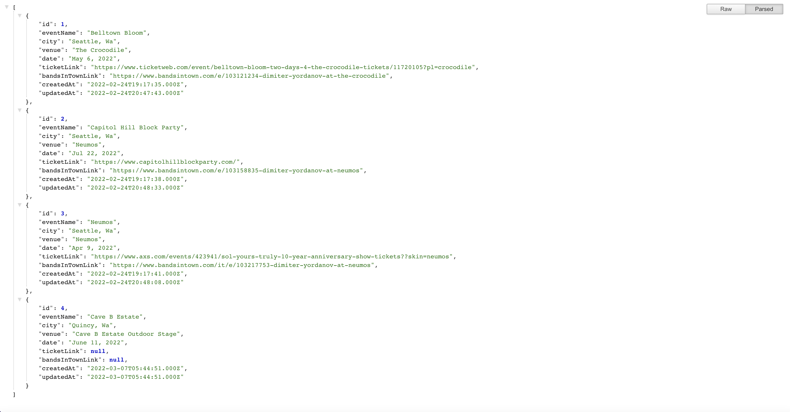

# Dimiter's Concert API 

## Description
A simple REST API built with a Node.js/Express.js server and SQL database that is used
to manage my concerts and display them to my website.

## Table of Contents
  - [Description](#description)
  - [Table of Contents](#table-of-contents)
  - [Usage](#usage)
  - [Contributing](#contributing)
  - [License](#license)
  - [Questions](#questions)

## Usage

Visit the deployed API [here](https://api.dimitermusic.com/)  

Home Page:  
  

JSON view of API:  
  

Fetched and displayed to official website:   
  

## Contributing

Feedback always welcome!

## License

This application is covered under the Apache 2.0 License

## Questions

If you have any questions, please visit my GitHub profile or email me using the links below:

[Github Profile](https://github.com/dimitermusic)  
[Email Me](mailto:dimitermusic@gmail.com)